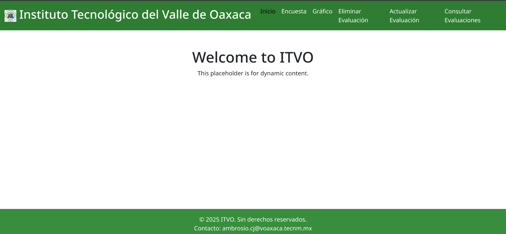
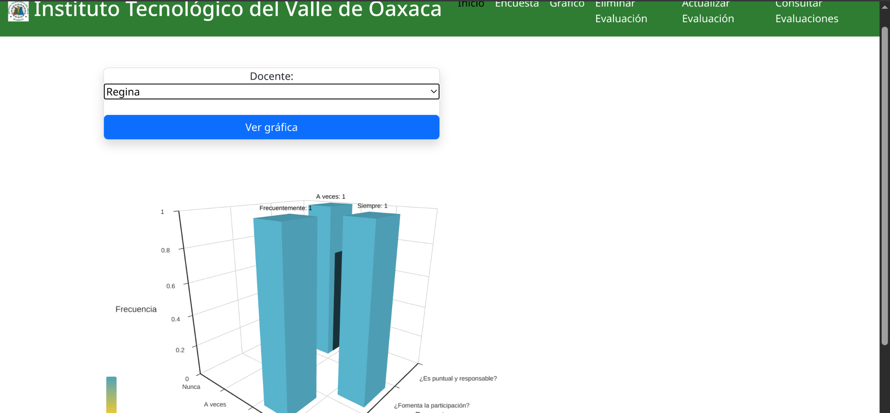

# Proyecto de MariaDB

Este proyecto es una aplicación desarrollada principalmente en PHP. Está diseñada para demostrar la conexión, manejo y operación de bases de datos MariaDB desde PHP.

## Requisitos

- PHP 
- Servidor web (Yo usare el de PHP)
- MariaDB 
- Navegador 

## Configuración

1. Configurar la base de datos y crear la base con el archivo `bd.sql`
2. Configurar un .env con parametros de conexión a MariaDB.
3. Para correr el servidor desde la terminal ejecutar:
`php --server localhost:8080 --docroot public router.php`
NOTA: Para acceder, se usa localhost:8080

